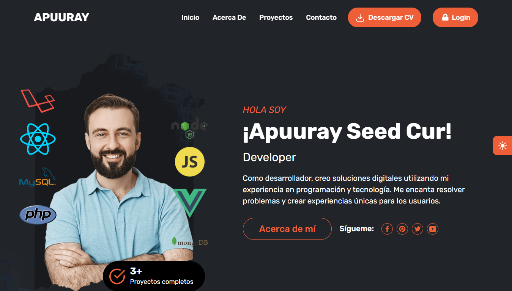
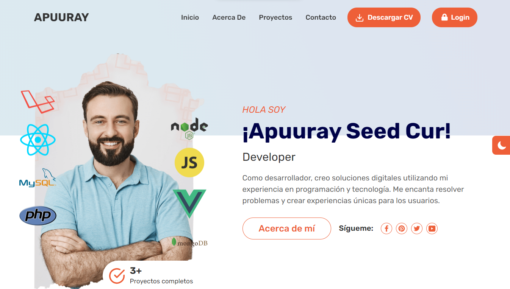
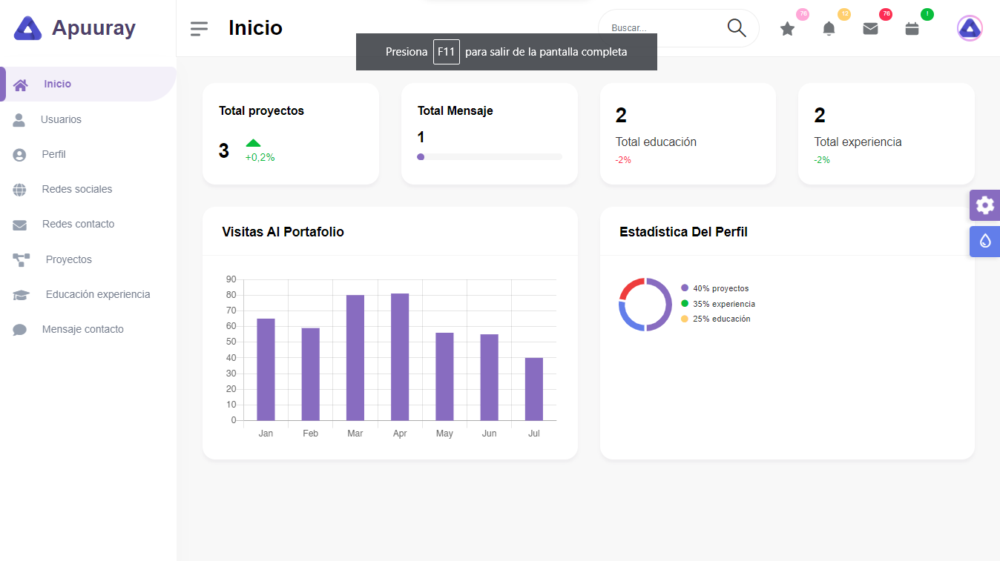
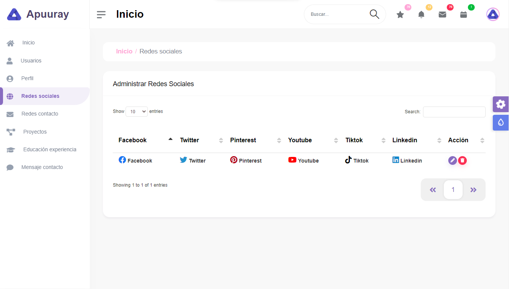
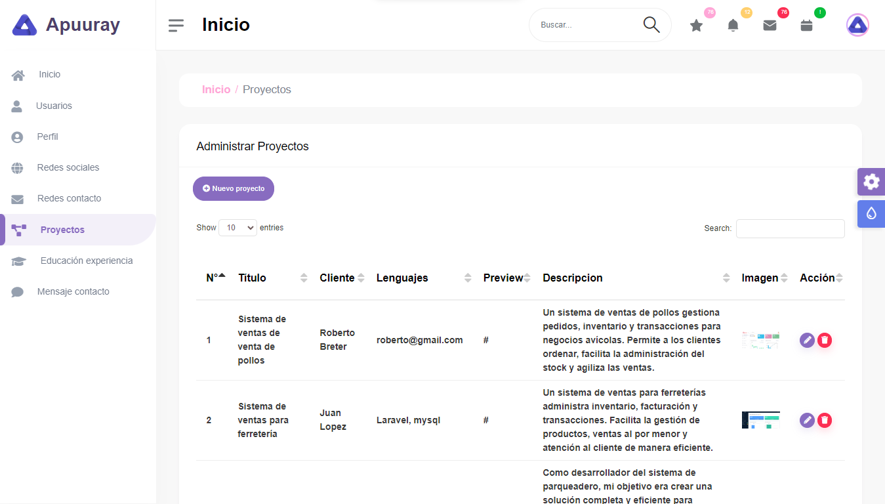
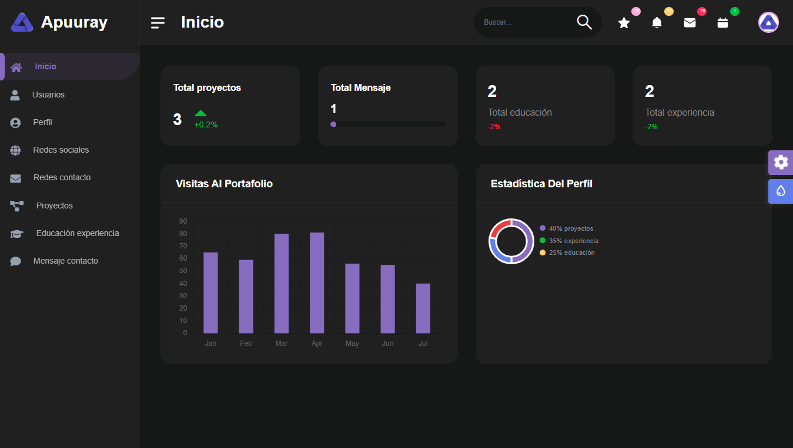

# PORTAFOLIO DEVELOPER 🚀

Portafolio personal creado con PHP y MySQL para mostrar habilidades, proyectos y experiencia laboral de manera profesional.

## Requisitos Previos 📋

- PHP (versión 8.2.12)
- MySQL (versión 8.0.0)

## Instalación 💻

1. Clona el repositorio: `git clone https://github.com/yorchavez9/portafolio-developer.git`

## Estructura del Proyecto 📁

- `index.php`: Archivo principal del proyecto.
- `controladores/`: Carpeta que contiene controladores.
- `modelos/`: Carpeta que contiene modelos.
- `vistas/`: Carpeta que contiene vistas.
    - `css/`: Carpeta que contiene archivos CSS.
    - `js/`: Carpeta que contiene archivos JavaScript.
    - `Módulos/`: Carpeta que contiene los módulos de admin y main.
- `vendor/`: Carpeta que contiene bibliotecas de terceros (por ejemplo, Composer).
- Otros directorios y archivos según sea necesario...

## 🛠️ Conexion a la Base de Datos

El proyecto utiliza una clase de conexión a la base de datos para interactuar con MySQL. Aquí tienes un ejemplo de cómo se realiza la conexión en PHP utilizando PDO:

```php
class Conexion {
    static public function conectar() {
        try {
            $link = new PDO("mysql:host=localhost;dbname=nombre_base_de_datos", "usuario_mysql", "contraseña_mysql");
            $link->setAttribute(PDO::ATTR_ERRMODE, PDO::ERRMODE_EXCEPTION);
            $link->exec("set names utf8");
            return $link;
        } catch (PDOException $e) {
            die("Error al conectar a la base de datos: " . $e->getMessage());
        }
    }
}
```
## Demo

Demo: https://apuuraysis.com/

Correo: admin@gmail.com
Contraseña: Admin123

## Vistas 










## Contribución 🤝

Si deseas contribuir al proyecto, sigue estos pasos:

1. Haz un fork del repositorio.
2. Crea una rama para tu nueva característica (`git checkout -b feature/nueva-caracteristica`).
3. Haz tus cambios y commitea (`git commit -am 'Agrega una nueva característica'`).
4. Haz push a la rama (`git push origin feature/nueva-caracteristica`).
5. Haz un pull request en el repositorio original.


## Licencia 📄

Este proyecto está bajo la Licencia MIT - ve el archivo [LICENSE.md](LICENSE.md) para más detalles.
